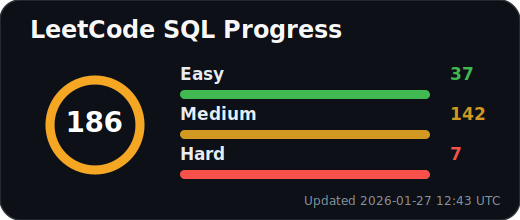
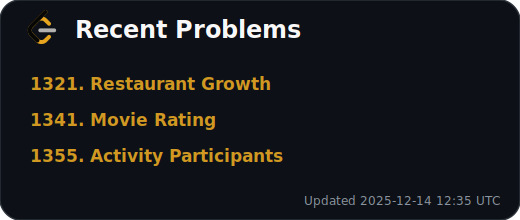

  

## ✨ About Me 
> ***"I bridge the gap between statistical theory and real-world application, building robust ML pipelines and cleaning messy data to solve actual problems."***

## 🚀 Tools and Languages I use 

  
  
  
  
  
  
  
  

## 🧠 Stats 

  
  

## 🔗 Connect with Me 

✨ *Thanks for visiting my profile! Always learning, always building.*  
