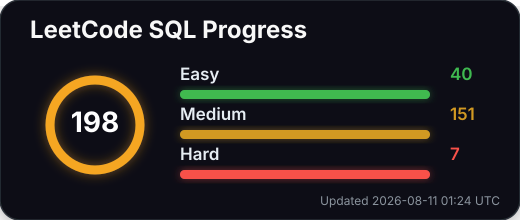
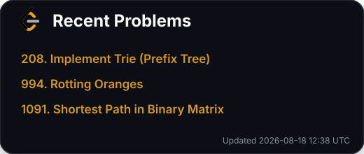

<div align="center">
  
</div>

<div align="center">

[](https://github.com/henryng15)

# Henry Nguyen (Hoan Nguyen)

**Software Engineer · Data Scientist · Machine Learning**<br>
Mathematics & Computer Science @ Kenyon College · GPA 4.0 · Class of 2028

[](https://hoanng.netlify.app/)
[](https://www.linkedin.com/in/hoanng15/)
[](mailto:hoanng15.work@gmail.com)
[](#)

`🟢 OPEN TO INTERNSHIPS — FALL 2026 · SPRING 2027 · SUMMER 2027`

</div>


## 👾 About Me

> ***"Success isn't the treasure you find — it's the wizard you become chasing it."***

I'm a Mathematics & Computer Science student at **Kenyon College** who builds data science and software systems — from **ML pipelines and LLM/RAG tooling** to **production full-stack applications**. I like the messy middle: cleaning real data, designing schemas that hold up, and shipping services that stay reliable under load.

```yaml
name:         Henry Nguyen
also_known_as: Hoan Nguyen
role:         Software Engineer · Data Scientist
education:    Kenyon College — B.A. Mathematics & Computer Science (GPA 4.0, 2028)
location:     Gambier, Ohio, United States
focus:        [Full-Stack Engineering, Machine Learning, Data Engineering, LLM/RAG Systems]
fellowships:  [SEO Tech Developer, Break Through Tech AI, Out for Undergrad]
availability: [Fall 2026, Spring 2027, Summer 2027]
email:        hoanng15.work@gmail.com
website:      https://hoanng.netlify.app/
```


## ⛏️ Inventory — Tech Stack

**Languages:** Python · Java · TypeScript · JavaScript · SQL · C · C++ · R · Solidity

<p>
  
  
  
  
  
  
  
  
</p>

**AI & Machine Learning:** LangChain · LangGraph · RAG · MCP · OpenAI API · Ollama · PyTorch · scikit-learn · XGBoost · SciPy · Pydantic · pgvector

<p>
  
  
  
  
  
  
  
  
</p>

**Frameworks & Runtime:** React · Next.js · Django REST · FastAPI · Flask · Node.js · Netty · REST APIs · WebSockets · WebRTC · Celery · pytest

<p>
  
  
  
  
  
  
  
</p>

**Data & Infrastructure:** PostgreSQL · MongoDB · DuckDB · Supabase · Snowflake · dbt · Polars · Prefect · Drizzle ORM · SQLAlchemy · Docker · AWS · Azure · Git · GitHub Actions

<p>
  
  
  
  
  
  
  
  
  
</p>

### 🧱 Proficiency Bars

```text
Full-Stack (React / Next.js)   ██████████████████░░  92
Backend (Python / Node)        ██████████████████░░  90
Databases (SQL / NoSQL)        █████████████████░░░  88
Machine Learning / AI          █████████████████░░░  85
Cloud / DevOps                 ████████████████░░░░  82
Data Engineering               ████████████████░░░░  80
```


## 🏰 Experience

| Role | Company | Period | Location | Stack |
|---|---|---|---|---|
| **Software Engineer Intern** | Todd AgriScience | Jun 2026 – Present | Remote | TypeScript, Next.js, Drizzle ORM, GitHub Actions, Azure |
| **Data Science Intern** | Mined XAI | May 2026 – Present | Remote | Python, DuckDB, Polars, scikit-learn, MCP |
| **Software Engineer Intern** | IpserLabs | Mar 2026 – May 2026 | Mountain View, CA | Java, Jakarta EE, Netty, WebSockets, WebRTC |
| **Software Engineer Intern** | Kenyon College | Aug 2025 – Dec 2025 | Gambier, OH | React, Python, C++, WebSockets, SQL |
| **Summer Analyst** | Vietcombank | Summer 2025 | Hanoi, Vietnam | Python, SQL, Data Analysis |

**Education:** Kenyon College — B.A. Mathematics & Computer Science, GPA 4.0, expected 2028<br>
**Fellowships & Programs:** [SEO Tech Developer](https://www.seo-usa.org/) · [Break Through Tech AI](https://www.breakthroughtech.org/) · [Out for Undergrad (O4U)](https://www.outforundergrad.org/)


## 💎 Featured Builds

| Project | What it does | Stack |
|---|---|---|
| **[ThesisLedger](https://github.com/henryng15/thesisledger)** ⭐ | Equity-research assistant that breaks an investment thesis into testable claims and verifies each against SEC 10-K/10-Q filings via RAG — every verdict cites a real passage, no fabricated citations. | Django REST, Celery/Redis, PostgreSQL + pgvector, LangChain, LangGraph, Ollama, Next.js, Docker |
| **[ProofVault](https://github.com/henryng15/ProofVault)** | Blockchain-anchored chain of custody for legal evidence files, with integrity verified from on-chain logs. | Solidity, Hardhat, Polygon, FastAPI, AWS |
| **[MenuLens](https://github.com/henryng15/MenuLens)** | Eating-out decision engine that ranks restaurant dishes against calorie, budget, and protein constraints. | Next.js, TypeScript, FastAPI, Supabase, LangChain, OpenAI Vision |
| **[TigerCook](https://github.com/henryng15/tigercook)** | AI recipe generator for college students — 5 constraints in, structured recipe + nutrition out. [Live demo](https://main.da2b7mgpkz0d5.amplifyapp.com) | React, Firebase Auth/Firestore, OpenAI, AWS Amplify |
| **[Hillstrom A/B & Uplift](https://github.com/henryng15/AB_Email_Testing)** | A/B testing and uplift modeling on the Hillstrom email experiment — Qini curves and incremental ROI to build profit-maximizing targeting policies. | Python, scikit-learn, causal inference, statsmodels |
| **[EvalOps Metric Assistant](https://github.com/henryng15/evalops-metric-assistant)** | Turns plain-language AI feedback into structured evaluation plans and metrics. Capstone with the Laboratory for Analytic Sciences (LAS). | Flask, Claude API, Python |


## 📊 GitHub Stats

<div align="center">


### 🏆 Achievements Unlocked


### 🌱 Contribution Graph


</div>

### 🗡️ LeetCode SQL Progress <sub>(auto-updated daily)</sub>

<div align="center">
  
  
</div>


## 🧭 Connect

- **Email:** [hoanng15.work@gmail.com](mailto:hoanng15.work@gmail.com)
- **LinkedIn:** [linkedin.com/in/hoanng15](https://www.linkedin.com/in/hoanng15/)
- **Portfolio:** [hoanng.netlify.app](https://hoanng.netlify.app/)
- **GitHub:** [github.com/henryng15](https://github.com/henryng15)
- **Open to:** Software Engineering, Data Science, and Machine Learning internships — Fall 2026, Spring 2027, Summer 2027

<details>
<summary><b>📇 Machine-readable profile (for recruiters &amp; automated tools)</b></summary>

```json
{
  "@context": "https://schema.org",
  "@type": "Person",
  "name": "Henry Nguyen",
  "alternateName": "Hoan Nguyen",
  "jobTitle": ["Software Engineer", "Data Scientist"],
  "email": "hoanng15.work@gmail.com",
  "url": "https://hoanng.netlify.app/",
  "sameAs": [
    "https://github.com/henryng15",
    "https://www.linkedin.com/in/hoanng15/"
  ],
  "address": {
    "@type": "PostalAddress",
    "addressLocality": "Gambier",
    "addressRegion": "OH",
    "addressCountry": "US"
  },
  "alumniOf": {
    "@type": "CollegeOrUniversity",
    "name": "Kenyon College",
    "description": "B.A. Mathematics & Computer Science, GPA 4.0, expected 2028"
  },
  "knowsAbout": [
    "Python", "Java", "TypeScript", "JavaScript", "SQL", "C", "C++", "R", "Solidity",
    "React", "Next.js", "Django REST Framework", "FastAPI", "Flask", "Node.js", "Netty",
    "LangChain", "LangGraph", "Retrieval-Augmented Generation", "Model Context Protocol",
    "PyTorch", "scikit-learn", "XGBoost", "Pandas", "Polars", "NumPy", "SciPy",
    "PostgreSQL", "pgvector", "MongoDB", "DuckDB", "Supabase", "Snowflake", "dbt",
    "Docker", "AWS", "Microsoft Azure", "GitHub Actions", "CI/CD",
    "Machine Learning", "Data Engineering", "A/B Testing", "Causal Inference", "Statistics"
  ],
  "hasOccupation": [
    { "@type": "Role", "roleName": "Software Engineer Intern", "affiliation": "Todd AgriScience", "startDate": "2026-06", "endDate": "present", "location": "Remote" },
    { "@type": "Role", "roleName": "Data Science Intern", "affiliation": "Mined XAI", "startDate": "2026-05", "endDate": "present", "location": "Remote" },
    { "@type": "Role", "roleName": "Software Engineer Intern", "affiliation": "IpserLabs", "startDate": "2026-03", "endDate": "2026-05", "location": "Mountain View, CA" },
    { "@type": "Role", "roleName": "Software Engineer Intern", "affiliation": "Kenyon College", "startDate": "2025-08", "endDate": "2025-12", "location": "Gambier, OH" },
    { "@type": "Role", "roleName": "Summer Analyst", "affiliation": "Vietcombank", "startDate": "2025-06", "endDate": "2025-08", "location": "Hanoi, Vietnam" }
  ],
  "award": ["SEO Tech Developer", "Break Through Tech AI", "Out for Undergrad (O4U)"],
  "seeks": {
    "@type": "Demand",
    "name": "Software Engineering / Data Science / Machine Learning Internship",
    "availability": ["Fall 2026", "Spring 2027", "Summer 2027"]
  }
}
```

</details>

<div align="center">


✨ *Thanks for visiting — always learning, always building.* ⛏️

`◆ KEEP DIGGING ◆`

</div>
